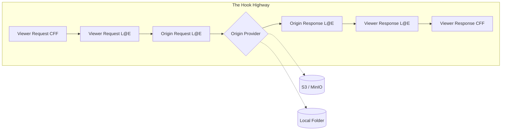

# CloudFrontize Architecture

This document describes the design philosophy, high-fidelity simulation models, and modular service architecture of the CloudFrontize emulator. CloudFrontize is engineered to provide bit-for-bit behavioral parity with the AWS CloudFront request life-cycle.

---

## 0. One-Pager: How It Works Internally ⚡

CloudFrontize is not a simple proxy; it is a **Propagator and Sandbox Engine**. It ensures that "It works on my machine" finally means "It works in AWS."

### 0.1 The Hook Highway (Visual Flow)
Every request travels through a strictly sequential pipeline. The **Orchestrator** manages this lifecycle:



### 0.2 The Core Engines (Component Reference)

| Component | Code Path | Architectural Role |
| :--- | :--- | :--- |
| **Orchestrator** | `src/pipeline/Orchestrator.ts` | **The Brain.** Manages the Hook Highway and State Roll-Forward. |
| **HeaderManager** | `src/core/HeaderManager.ts` | **The Fidelity Layer.** Preserves casing and multi-value headers. |
| **EdgeRunner** | `src/core/EdgeRunner.ts` | **Lambda@Edge Sandbox.** Simulates the Node.js L@E runtime. |
| **CFFRunner** | `src/core/CFFRunner.ts` | **CFF Sandbox.** Strict ES5.1 sandbox for CloudFront Functions. |
| **OriginSelector** | `src/pipeline/OriginSelector.ts` | **The Router.** Maps path patterns to specific providers. |
| **Telemetry** | `src/pipeline/Telemetry.ts` | **The Black Box.** Captures and broadcasts stage-by-stage snapshots. |

### 0.3 Developer Map: Core Logic Locations
- **Pipeline Execution**: `src/pipeline/Orchestrator.ts`
- **Sandbox Engines**: `src/core/EdgeRunner.ts` / `src/core/CFFRunner.ts`
- **Fidelity Normalization**: `src/core/HeaderManager.ts`
- **Origin Implementations**: `src/pipeline/Providers/`
- **WebUI Backend**: `src/pipeline/WebUI.ts`

---

## 1. The Core Lifecycle: The "Hook Highway" 🚀

CloudFrontize processes incoming HTTP requests through a strict, sequential pipeline mimicking the internal hook structure of AWS.

### 1.1 The Network Simulation Layer
Before the first hook runs, the Orchestrator injects **Sticky Headers** (Header Intelligence) into the request. This simulates the CloudFront Network Layer, providing hooks with realistic metadata such as Geo-location and Device type headers (`this._injectStickyHeaders`).

### 1.2 The Hook Chain (Execution Matrix)

| # | Stage Name | Runner | AWS Lifecycle Event | Mutation Power |
| :--- | :--- | :--- | :--- | :--- |
| 1 | **Viewer Request** | CFF | `viewer-request` | Headers, URI, Cookies |
| 2 | **Viewer Request** | L@E | `viewer-request` | Full (Headers, Body, URI) |
| 3 | **Origin Request** | L@E | `origin-request` | Full (Headers, Body, URI) |
| 4 | **Origin Provider** | Provider | (The Fetch) | N/A (Produces Response) |
| 5 | **Origin Response**| L@E | `origin-response`| Headers, Status (Blind Body) |
| 6 | **Viewer Response**| L@E | `viewer-response`| Headers, Status (Blind Body) |
| 7 | **Viewer Response**| CFF | `viewer-response`| Headers only |

### 1.3 State Roll-Forward (Fidelity First)
To ensure 100% production parity, the emulator enforces a **Strict Overwrite Rule**:
- We do not "merge" hook outputs with previous state.
- If a hook returns a response or a header modification, that object **replaces** the internal state for the next stage.
- This ensures that if a developer's hook intends to delete a header, it is actually deleted in the emulator.

### 1.4 The "Blind Response" Protocol
To ensure 100% production parity, the emulator enforces the **Blind Response Rule**:
- In `origin-response` and `viewer-response`, the `event.Records[0].cf.response.body` field is **absent** (undefined).
- Functions can **replace** the body by returning a new one, but they can never inspect what the origin sent.

---

## 2. Component Breakdown 🧩

### A. The Orchestrator (`src/pipeline/Orchestrator.ts`)
The "Brain" of the system. Coordinates execution and implements the body resolution logic (`_resolveBody` / `_serializeBody`). It ensures the output is always a valid Node.js response while maintaining the internal "Hook Highway" state.

### B. Header Management Service (`src/core/HeaderManager.ts`)
The central authority for header integrity. It uses the **Internal Fidelity Format (IFF)**:
`Record<string, { key: string; value: string }[]>`

#### **IFF Example (The "Source of Truth")**
```json
{
  "set-cookie": [
    { "key": "Set-Cookie", "value": "ID=123; Path=/" },
    { "key": "Set-Cookie", "value": "Theme=Dark" }
  ],
  "x-custom-id": [
    { "key": "X-Custom-ID", "value": "A-77" }
  ]
}
```
This format bypasses Node.js normalization (which would lowercase `x-custom-id`) and ensures multi-value preservation.

### C. The Runners (Execution Engines)
Runners execute user-provided code within isolated environments using the Node.js `vm` module:
- **`EdgeRunner.ts`:** Implements a high-fidelity Node.js `vm` sandbox for Lambda@Edge. It maps human-friendly Node responses to the complex AWS `event` structure and back.
- **`CFFRunner.ts`**: Executes the high-performance **CloudFront Function** logic, enforcing strict ES5.1 compliance and CloudFront-global object availability.

### D. Origin Providers (Data Resolution)
- **`LocalProvider`:** Efficiently serves local workspace assets while simulating S3-specific behaviors.
- **`S3Provider`:** Simulates CloudFront connectivity to AWS S3. It bridges S3 metadata (ETags, Content-Types) back to standard HTTP headers and provides diagnostic context for connectivity failures.

---

## 3. Advanced Fidelity: Body Serialization (`_resolveBody`) 💾

The Orchestrator ensures that large binary files can pass through hooks safely without corruption or OOM errors.

### 3.1 Transformation Pipeline
| Stage | Data Format | Logic |
| :--- | :--- | :--- |
| **Origin Fetch** | `Buffer` | Raw binary stream from S3 or Local Disk. |
| **Hook Handoff** | `Base64 String` | Sliced to **1MB** (AWS Limit) via `inputTruncated` flag. |
| **Hook Return** | `String / Object` | The hook can return a new body. If it returns nothing, we "Roll-Forward" the original origin Buffer. |
| **Final Resolution**| `Buffer` | The `_resolveBody` method converts the hook's return (Buffer, Base64, or Raw String) back into a bit-perfect binary for the wire. |

---

## 4. Origin & Routing Configuration (`--origins`) 🗺️

CloudFrontize uses a simple model to manage routing between different data sources. This configuration is defined in the JSON file passed via the `--origins` flag.

### 4.1 Technical Reference (JSON Schema)

The configuration file consists of two primary arrays: `origins` and `behaviors`.

#### **OriginConfig Object**
| Property | Type | Description |
| :--- | :--- | :--- |
| `id` | `string` | **Required.** Unique identifier for the origin. |
| `type` | `string` | **Required.** One of `s3`, `local`, or `custom`. |
| `bucket` | `string` | (S3 Only) Name of the bucket. |
| `region` | `string` | (S3 Only) AWS region (e.g., `us-east-1`). |
| `endpoint` | `string` | (S3/Custom) URL of the server (e.g., `http://localhost:4566`). |
| `credentials`| `object` | (S3 Only) Object with `accessKeyId` and `secretAccessKey`. |
| `directory` | `string` | (Local Only) Absolute or relative path to the folder. |
| `mode` | `string` | (S3 Only) Either `website` or `rest`. |

#### **CacheBehavior Object**
| Property | Type | Description |
| :--- | :--- | :--- |
| `pathPattern` | `string` | **Required.** CloudFront-style pattern (e.g., `*`, `/api/*`, `*.jpg`). |
| `targetOriginId`| `string` | **Required.** The `id` of the origin defined in the `origins` array. |

### 4.2 Multi-Provider "Power User" Example
This example demonstrates routing between LocalStack, MinIO, and a Local Folder simultaneously:

```json
{
  "origins": [
    { 
      "id": "LocalStack-Data", 
      "type": "s3", 
      "bucket": "dev-data",
      "endpoint": "http://localhost:4566"
    },
    { 
      "id": "MinIO-Assets", 
      "type": "s3", 
      "bucket": "media",
      "endpoint": "http://localhost:9000",
      "credentials": { "accessKeyId": "admin", "secretAccessKey": "password" }
    },
    { 
      "id": "Static-UI", 
      "type": "local", 
      "directory": "./dist" 
    }
  ],
  "behaviors": [
    { "pathPattern": "/api/*", "targetOriginId": "LocalStack-Data" },
    { "pathPattern": "/media/*", "targetOriginId": "MinIO-Assets" },
    { "pathPattern": "*", "targetOriginId": "Static-UI" }
  ]
}
```

---

## 5. System State & Concurrency 🧵

- **Request-Scoped State**: Headers, Body Snapshots, and the "Journey ID" are unique per request. The Orchestrator creates a new **State Container** for every incoming connection to ensure 100% isolation.
- **Singleton Services**: The `HistoryStore`, `HookRegistry`, and `WebUI` are singletons. They manage global state that persists across multiple requests.
- **Thread Safety**: Since Node.js is single-threaded, the Orchestrator relies on asynchronous isolation. We use the **IFF (Internal Fidelity Format)** to ensure that one request's header mutations never bleed into another.

---

## 6. Telemetry & Forensics 📊

- **Atomic Journey**: Every request creates a forensic journey record, capturing the state of headers and bodies at every stage of the pipeline via `broadcastStage()`.
- **Live Stream**: The WebUI receives live updates via Server-Sent Events (SSE).
- **Snapshot Logic**: Forensics use a **1 MB cap** (configurable via `AWS_LIMITS`) for body previews to ensure the dashboard remains high-performance.
