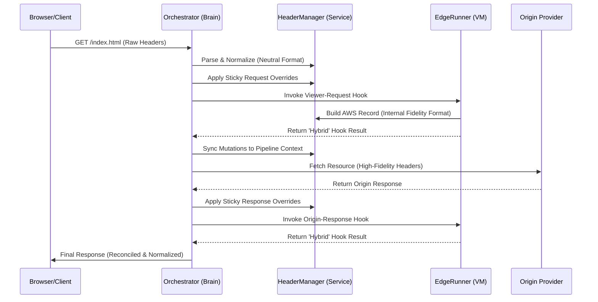

# CloudFrontize Architecture

This document describes the design philosophy, high-fidelity simulation models, and modular service architecture of the CloudFrontize emulator. CloudFrontize is engineered to provide bit-for-bit behavioral parity with the AWS CloudFront request life-cycle.

---

## 1. The Core Lifecycle: The "Hook Highway" 🚀

CloudFrontize processes incoming HTTP requests through a strict, sequential pipeline mimicking the internal hook structure of AWS.

### 1.1 Hook Chain Sequence
1. **Viewer Request (CFF):** Lightweight "CloudFront Function". ES5.1 restricted sandbox, ultra-low latency. Can return a response instantly (Short-circuit).
2. **Viewer Request (L@E):** "Lambda@Edge" Node.js runtime, strict 40KB body limits, module-access enforcement.
3. **Origin Provider (S3 or Local):** Resolves the request destination (e.g., serving static files or proxying an S3 bucket).
4. **Origin Response (L@E):** Mutates origin response status, headers, and body before caching/delivery.
5. **Viewer Response (CFF):** Final "CloudFront Function" lightweight header manipulations.

### 1.2 Header Lifecycle Sequence (Mermaid)
The following diagram visualizes how headers (including "Sticky" overrides) navigate the pipeline:

---

## 2. Component Breakdown 🧩

### A. The Orchestrator (`src/pipeline/Orchestrator.ts`)
The "Brain" of the system. It manages the sequential execution of handlers and maintains the **Sticky Header Context**. It ensures that any header injected via the WebUI or CLI `--headers` flag is consistently synchronized throughout the lifecycle.

### B. Header Management Service (`src/core/HeaderManager.ts`)
The central authority for header integrity. It handles:
- **Normalization:** Translates between Node.js raw arrays and the Internal Fidelity Format.
- **Multi-Value Preservation:** Uses structured arrays to ensure headers like `Set-Cookie` are never truncated.
- **Reconciliation:** Enforces AWS Forbidden Header rules, ensuring simulation parity with real CloudFront restrictions.
- **Flattening:** Generates optimized "Neutral Format" maps for telemetry and response delivery.

### C. The Runners (The `HotRunner` Pattern)
Runners execute user-provided code within isolated environments with automatic hot-reloading:
- **`EdgeRunner.ts`:** Implements a high-fidelity Node.js `vm` sandbox for Lambda@Edge. It utilizes a **"Hybrid Return"** pattern, returning both a nested `HeaderMap` (for hook chain continuity) and flattened root keys (for legacy test compatibility).
- **`CFFRunner.ts`**: Executes the high-performance **CloudFront Function** logic, enforcing strict ES5.1 compliance and microsecond CPU timing constraints (<1ms).

### D. Origin Providers
- **`LocalProvider`:** Efficiently serves local workspace assets using `serve-handler`.
- **`S3Provider`:** Simulates CloudFront connectivity to AWS S3 buckets using the `@aws-sdk/client-s3` library.

---

## 3. Technology Stack & Tooling 🛠️

- **Runtime:** Node.js (v20+) matching AWS Lambda@Edge parity.
- **Build Engine:** `tsup` (esbuild + swc) for high-performance, minified production bundling.
- **Execution:** `tsx` for localized, high-speed development and test runners.
- **Testing:** `jest` + `@swc/jest` for high-throughput, parallel E2E verification.
- **Telemetry:** SSE (Server-Sent Events) live streaming of measurements, including **Forensic Header Snapshots** for every execution stage.
