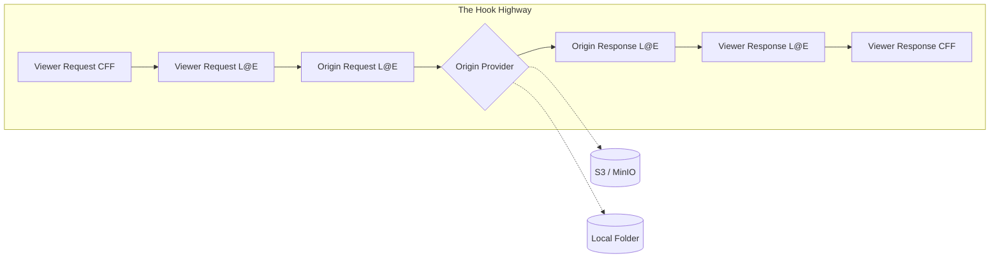

# CloudFrontize Architecture

This document describes the design philosophy, high-fidelity simulation models, and modular service architecture of the CloudFrontize emulator. CloudFrontize is engineered to provide bit-for-bit behavioral parity with the AWS CloudFront request life-cycle.

---

## 0. One-Pager: How It Works Internally ⚡

CloudFrontize is not a simple proxy; it is a **Propagator and Sandbox Engine**. It ensures that "It works on my machine" finally means "It works in AWS."

### 0.1 The Hook Highway (Visual Flow)
Every request travels through a strictly sequential pipeline. The **Orchestrator** manages this lifecycle:

### 0.2 The Core Engines
*   **The Brain (`Orchestrator.ts`)**: Manages the highway. Implements the **"Silver Bullet" Serializer** to ensure regardless of how a hook returns a body (Buffer, String, or AWS Object), it correctly resolves to raw bytes.
*   **The Sandboxes (`Runners`)**: Executes code in isolation. 
    *   **EdgeRunner** (L@E): Mirrors the Node.js runtime with 1MB body snapshots.
    *   **CFFRunner** (CFF): Enforces a strict ES5.1 sandbox for ultra-fast header logic.
*   **The Data Sources (`Providers`)**: Fetch the actual content.
    *   **LocalProvider**: Emulates S3 website-hosting behaviors on local files.
    *   **S3Provider**: Proxies to real S3/MinIO with AWS-SDK fidelity.
*   **The Fidelity Layer (`HeaderManager.ts`)**: Bypasses standard Node.js normalization. It maintains **"Wire-Case" Fidelity** (e.g., `X-Custom-ID` stays as is) for bit-for-bit accuracy.

### 0.3 Developer Map: Where to Start Coding?
If you want to contribute, here is where the logic lives:
- **Core Pipeline**: `src/pipeline/Orchestrator.ts`
- **Hook Runtimes**: `src/core/EdgeRunner.ts` / `src/core/CFFRunner.ts`
- **Header Logic**: `src/core/HeaderManager.ts`
- **Forensic UI (React)**: `ui-src/src/components/`

---

## 1. The Core Lifecycle: The "Hook Highway" 🚀

CloudFrontize processes incoming HTTP requests through a strict, sequential pipeline mimicking the internal hook structure of AWS.

### 1.1 Hook Chain Sequence
1. **Viewer Request (CFF):** Lightweight "CloudFront Function". ES5.1 restricted sandbox, ultra-low latency. Can return a response instantly (Short-circuit).
2. **Viewer Request (L@E):** "Lambda@Edge" Node.js runtime. Supports 1MB snapshots with `inputTruncated` flag.
3. **Origin Request (L@E):** Authorized to rewrite URIs or modify bodies before they hit the origin provider.
4. **Origin Provider (S3/MinIO or Local):** Resolves the target asset.
5. **Origin Response (L@E):** **Strictly Blind** in production. It can replace headers and status but cannot read the origin body.
6. **Viewer Response (L@E):** Final Lambda stage. Overwrites previous body replacements if returned.
7. **Viewer Response (CFF):** Final lightweight header manipulations.

### 1.2 The "Blind Response" Protocol
To ensure 100% production parity, the emulator enforces the **Blind Response Rule**:
- In `origin-response` and `viewer-response`, the `event.Records[0].cf.response.body` field is **absent** (undefined).
- Functions can **replace** the body by returning a new one, but they can never inspect what the origin sent.

### 1.3 High-Fidelity Body Handling
- **Request Truncation**: Bodies passed to L@E are capped at **1 MB** (AWS Limit).
- **Pass-through Safety**: Large files (up to GB-scale) pass through the emulator as raw Buffers. They are only encoded to base-64 for the L@E snapshot, ensuring the browser receives original binary data.

---

## 2. Component Breakdown 🧩

### A. The Orchestrator (`src/pipeline/Orchestrator.ts`)
The "Brain" of the system. Coordinates execution and implements the **Silver Bullet Serializer**. It ensures the output is always a valid Node.js response while maintaining the internal "Hook Highway" state.

### B. Header Management Service (`src/core/HeaderManager.ts`)
The central authority for header integrity. It handles:
- **Normalization:** Translates between Node.js raw wire-headers and the Internal Fidelity Format (IFF) to bypass runtime normalization.
- **Multi-Value Preservation:** Uses structured arrays to ensure headers like `Set-Cookie` are never truncated.
- **Case Fidelity:** Preserves the original casing of headers (e.g. `X-Custom-ID`) for telemetry and final delivery.

### C. The Runners (Execution Engines)
Runners execute user-provided code within isolated environments using the Node.js `vm` module:
- **`EdgeRunner.ts`:** Implements a high-fidelity Node.js `vm` sandbox for Lambda@Edge. It maps human-friendly Node responses to the complex AWS `event` structure and back.
- **`CFFRunner.ts`**: Executes the high-performance **CloudFront Function** logic, enforcing strict ES5.1 compliance and CloudFront-global object availability.

### D. Origin Providers (Data Resolution)
- **`LocalProvider`:** Efficiently serves local workspace assets while simulating S3-specific behaviors (e.g. 403 on folder index if not in website mode).
- **`S3Provider`:** Simulates CloudFront connectivity to AWS S3 buckets (compatible with **MinIO**). It is responsible for bridging S3 metadata (ETags, Content-Types) back to standard HTTP headers.

---

## 3. Telemetry & Forensics 📊

- **Atomic Journey**: Every request creates a forensic journey record, capturing the state of headers and bodies at every stage of the pipeline.
- **Live Stream**: The WebUI receives live updates via Server-Sent Events (SSE).
- **Snapshot Logic**: Forensics use a **1 MB cap** for body previews to ensure the dashboard remains high-performance even when serving large assets.
