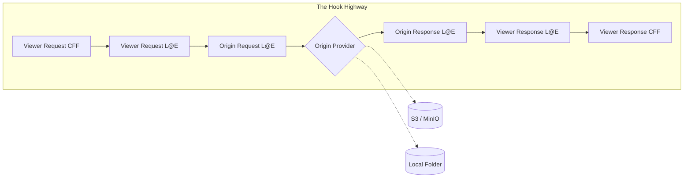

# CloudFrontize Architecture

This document describes the design philosophy, high-fidelity simulation models, and modular service architecture of the CloudFrontize emulator. CloudFrontize is engineered to provide bit-for-bit behavioral parity with the AWS CloudFront request life-cycle.

---

## 0. One-Pager: How It Works Internally ⚡

CloudFrontize is not a simple proxy; it is a **Propagator and Sandbox Engine**. It ensures that "It works on my machine" finally means "It works in AWS."

### 0.1 The Hook Highway (Visual Flow)
Every request travels through a strictly sequential pipeline. The **Orchestrator** manages this lifecycle:


```mermaid
graph LR
    subgraph "The Hook Highway"
    A[Viewer Request CFF] --> B[Viewer Request L@E]
    B --> C[Origin Request L@E]
    C --> D{Origin Provider}
    D --> E[Origin Response L@E]
    E --> F[Viewer Response L@E]
    F --> G[Viewer Response CFF]
    end
    D -.-> S3[(S3 / MinIO)]
    D -.-> LOC[(Local Folder)]
```

### 0.2 The Core Engines (Component Reference)

| Component | Code Path | Architectural Role |
| :--- | :--- | :--- |
| **Orchestrator** | `src/pipeline/Orchestrator.ts` | **The Brain.** Manages the Hook Highway and State Roll-Forward. |
| **HeaderManager** | `src/core/HeaderManager.ts` | **The Fidelity Layer.** Preserves casing and multi-value headers. |
| **EdgeRunner** | `src/core/EdgeRunner.ts` | **Lambda@Edge Sandbox.** Simulates the Node.js L@E runtime. |
| **CFFRunner** | `src/core/CFFRunner.ts` | **CFF Sandbox.** CloudFront Functions runtimes 1.0 (ES 5.1) and 2.0, with KeyValueStore. |
| **OriginSelector** | `src/pipeline/OriginSelector.ts` | **The Router.** Maps path patterns to specific providers. |
| **Telemetry** | `src/pipeline/Telemetry.ts` | **The Black Box.** Captures and broadcasts stage-by-stage snapshots. |

### 0.3 Developer Map: Core Logic Locations
- **Pipeline Execution**: `src/pipeline/Orchestrator.ts`
- **Sandbox Engines**: `src/core/EdgeRunner.ts` / `src/core/CFFRunner.ts`
- **Fidelity Normalization**: `src/core/HeaderManager.ts`
- **Origin Implementations**: `src/pipeline/Providers/`
- **WebUI Backend**: `src/pipeline/WebUI.ts`

---

## 1. The Core Lifecycle: The "Hook Highway" 🚀

CloudFrontize processes incoming HTTP requests through a strict, sequential pipeline mimicking the internal hook structure of AWS.

### 1.1 The Network Simulation Layer
Before the first hook runs, the Orchestrator injects **Sticky Headers** (Header Intelligence) into the request. This simulates the CloudFront Network Layer, providing hooks with realistic metadata such as Geo-location and Device type headers. Simulated headers on the CloudFront-added list (`AWS_HEADERS.CLOUDFRONT_ADDED`) are kept aside (`_splitSimulatedHeaders`): CloudFront Functions get them overlaid on their event, and they are added to the live request just before origin-request (`_addCloudFrontHeaders`), so Lambda@Edge sees them only on origin events and at the origin. Lambda@Edge viewer-response gets a viewer-facing copy of the request with the viewer's own values.

### 1.2 The Hook Chain (Execution Matrix)

| # | Stage Name | Runner | AWS Lifecycle Event | Mutation Power |
| :--- | :--- | :--- | :--- | :--- |
| 1 | **Viewer Request** | CFF | `viewer-request` | Headers, URI, Cookies |
| 2 | **Viewer Request** | L@E | `viewer-request` | Full (Headers, Body, URI) |
| 3 | **Origin Request** | L@E | `origin-request` | Full (Headers, Body, URI) |
| 4 | **Origin Provider** | Provider | (The Fetch) | N/A (Produces Response) |
| 5 | **Origin Response**| L@E | `origin-response`| Headers, Status (Blind Body) |
| 6 | **Viewer Response**| L@E | `viewer-response`| Headers, Status (Blind Body) |
| 7 | **Viewer Response**| CFF | `viewer-response`| Headers only |

### 1.3 State Roll-Forward (Fidelity First)
To ensure 100% production parity, the emulator enforces a **Strict Overwrite Rule**:
- We do not "merge" hook outputs with previous state.
- If a hook returns a response or a header modification, that object **replaces** the internal state for the next stage.
- This ensures that if a developer's hook intends to delete a header, it is actually deleted in the emulator.

### 1.4 The "Blind Response" Protocol
To ensure 100% production parity, the emulator enforces the **Blind Response Rule**:
- In `origin-response` and `viewer-response`, the `event.Records[0].cf.response.body` field is **absent** (undefined).
- Functions can **replace** the body by returning a new one, but they can never inspect what the origin sent.

---

## 2. Component Breakdown 🧩

### A. The Orchestrator (`src/pipeline/Orchestrator.ts`)
The "Brain" of the system. Coordinates execution and implements the body resolution logic (`_resolveBody` / `_serializeBody`). It ensures the output is always a valid Node.js response while maintaining the internal "Hook Highway" state.

### B. Header Management Service (`src/core/HeaderManager.ts`)
The central authority for header integrity. It uses the **Internal Fidelity Format (IFF)**:
`Record<string, { key: string; value: string }[]>`

#### **IFF Example (The "Source of Truth")**
```json
{
  "set-cookie": [
    { "key": "Set-Cookie", "value": "ID=123; Path=/" },
    { "key": "Set-Cookie", "value": "Theme=Dark" }
  ],
  "x-custom-id": [
    { "key": "X-Custom-ID", "value": "A-77" }
  ]
}
```
This format bypasses Node.js normalization (which would lowercase `x-custom-id`) and ensures multi-value preservation.

### C. The Runners (Execution Engines)
Runners execute user-provided code within isolated environments using the Node.js `vm` module:
- **`EdgeRunner.ts`:** Implements a high-fidelity Node.js `vm` sandbox for Lambda@Edge. It maps human-friendly Node responses to the complex AWS `event` structure and back. The sandbox follows Lambda (`src/core/lambda/sandbox.ts`): any module in every event, resolved from the function's folder with a fallback to the bundled AWS SDK v3; a read-only file system except `/tmp` (mapped to `os.tmpdir()/cloudfrontize/<project>/tmp`, `EROFS` elsewhere); warnings for reads outside the project and for connections to localhost or private networks; and a Lambda-like `process` with only reserved variables plus the project's `.env`, never the host environment.
- **`CFFRunner.ts`**: Executes **CloudFront Functions**. Runtime 1.0 is checked as ES 5.1; runtime 2.0 (`src/core/cff2/runtime2.ts`) is validated against AWS's feature list, runs with `microtaskMode: 'afterEvaluate'` so async handlers settle inside one guarded evaluation, gets the documented globals and a `require` limited to `crypto`/`querystring`/`buffer`, and reads key value stores (`src/core/KeyValueStore.ts`, AWS import format). Both runtimes freeze `Date` at the function's start time. Runaway loops in runtime 2.0 are stopped by an injected loop guard, because the VM timeout can't safely interrupt code that runs after an `await`.

#### Errors, Limits & Timing (`src/core/EdgeError.ts`, `src/constants.ts`)
Limits and rules follow the CloudFront Developer Guide (quotas and edge-function restrictions pages). Hook failures surface with the status CloudFront would return:
- **502 — validation error** (`LambdaValidationError` / `FunctionValidationError`), under `--strict`: adding a disallowed header, changing a per-event read-only header, a generated response over 40 KB (viewer) / 1 MB (origin), a replaced request body over its limit, a CloudFront Function over 10 KB, or combining CloudFront Functions with Lambda@Edge on viewer events (`InvalidFunctionAssociation`).
- **503 — execution error** (`LambdaExecutionError` / `FunctionExecutionError`): a thrown exception or rejected promise (CloudFront Functions: under `--strict`).
- **Timing only warns.** The AWS limits (Lambda@Edge 30 s; CloudFront Functions' 1 ms compute reference) are reference limits that warn in every mode, because local hardware isn't AWS hardware. Separate **enforced guards with leeway** stop only runaway code with a 503: `*_TIMEOUT_GUARD_MS` (60 s) for Lambda@Edge, and a 1 s VM timeout (`CFF_LIMITS.RUNAWAY_GUARD_MS`) for CloudFront Functions.

#### Pipeline Rules (AWS parity)
- Disallowed headers are never exposed to functions (request or response events).
- The request body exposed to a viewer-request function is truncated at 40 KB (1 MB for origin-request), with `inputTruncated: true`.
- **Cache behaviors** are matched first, on the viewer's original URI (in order; `*` and `?` wildcards; the default behavior last). The matched behavior decides the origin **and which functions run on each event**: project manifests attach functions per behavior; 2.x setups have one implicit behavior that runs every loaded hook. A rewrite doesn't change the behavior or origin.
- Functions are compiled once (a pool keyed by function id) and can be attached to several behaviors. A function that fails to build only blocks the behaviors that use it.
- Viewer-response functions don't run when the origin returns 400 or higher; a Lambda@Edge viewer-response function can't change the status code.

### D. Origin Providers (Data Resolution)
- **`LocalProvider`:** Efficiently serves local workspace assets while simulating S3-specific behaviors, including sending both `ETag` and `Last-Modified` (disable ETags with `--no-etag`).
- **`S3Provider`:** Simulates CloudFront connectivity to AWS S3. It bridges S3 metadata (ETags, Content-Types) back to standard HTTP headers and provides diagnostic context for connectivity failures.
- **SPA fallback (`--single`):** Handled by the Orchestrator for any provider: a GET/HEAD that the origin answers with 404 or 403 is re-fetched as `/index.html` and served with 200, before origin-response hooks run.

---

## 3. Advanced Fidelity: Body Serialization (`_resolveBody`) 💾

The Orchestrator ensures that large binary files can pass through hooks safely without corruption or OOM errors.

### 3.1 Transformation Pipeline
| Stage | Data Format | Logic |
| :--- | :--- | :--- |
| **Origin Fetch** | `Buffer` | Raw binary stream from S3 or Local Disk. |
| **Hook Handoff** | `Base64 String` | Sliced to **1MB** (AWS Limit) via `inputTruncated` flag. |
| **Hook Return** | `String / Object` | The hook can return a new body. If it returns nothing, we "Roll-Forward" the original origin Buffer. |
| **Final Resolution**| `Buffer` | The `_resolveBody` method converts the hook's return (Buffer, Base64, or Raw String) back into a bit-perfect binary for the wire. |

---

## 4. Origin & Routing Configuration (`--origins`) 🗺️

CloudFrontize uses a simple model to manage routing between different data sources. This configuration is defined in the JSON file passed via the `--origins` flag.

### 4.1 Technical Reference (JSON Schema)

The configuration file consists of two primary arrays: `origins` and `behaviors`.

#### **OriginConfig Object**
| Property | Type | Description |
| :--- | :--- | :--- |
| `id` | `string` | **Required.** Unique identifier for the origin. |
| `type` | `string` | **Required.** One of `s3`, `local`, or `custom`. |
| `bucket` | `string` | (S3 Only) Name of the bucket. |
| `region` | `string` | (S3 Only) AWS region (e.g., `us-east-1`). |
| `endpoint` | `string` | (S3/Custom) URL of the server (e.g., `http://localhost:4566`). |
| `credentials`| `object` | (S3 Only) Object with `accessKeyId` and `secretAccessKey`. |
| `directory` | `string` | (Local Only) Absolute or relative path to the folder. |
| `mode` | `string` | (S3 Only) Either `website` or `rest`. |

#### **CacheBehavior Object**
| Property | Type | Description |
| :--- | :--- | :--- |
| `pathPattern` | `string` | **Required.** CloudFront-style pattern (e.g., `*`, `/api/*`, `*.jpg`). |
| `targetOriginId`| `string` | **Required.** The `id` of the origin defined in the `origins` array. |

### 4.2 Multi-Provider "Power User" Example
This example demonstrates routing between LocalStack, MinIO, and a Local Folder simultaneously:

```json
{
  "origins": [
    { 
      "id": "LocalStack-Data", 
      "type": "s3", 
      "bucket": "dev-data",
      "endpoint": "http://localhost:4566"
    },
    { 
      "id": "MinIO-Assets", 
      "type": "s3", 
      "bucket": "media",
      "endpoint": "http://localhost:9000",
      "credentials": { "accessKeyId": "admin", "secretAccessKey": "password" }
    },
    { 
      "id": "Static-UI", 
      "type": "local", 
      "directory": "./dist" 
    }
  ],
  "behaviors": [
    { "pathPattern": "/api/*", "targetOriginId": "LocalStack-Data" },
    { "pathPattern": "/media/*", "targetOriginId": "MinIO-Assets" },
    { "pathPattern": "*", "targetOriginId": "Static-UI" }
  ]
}
```

---

## 5. System State & Concurrency 🧵

- **Request-Scoped State**: Headers, Body Snapshots, and the "Journey ID" are unique per request. The Orchestrator creates a new **State Container** for every incoming connection to ensure 100% isolation.
- **Singleton Services**: The `HistoryStore`, `HookRegistry`, and `WebUI` are singletons. They manage global state that persists across multiple requests.
- **Thread Safety**: Since Node.js is single-threaded, the Orchestrator relies on asynchronous isolation. We use the **IFF (Internal Fidelity Format)** to ensure that one request's header mutations never bleed into another.

---

## 6. Telemetry & Forensics 📊

- **Atomic Journey**: Every request creates a forensic journey record, capturing the state of headers and bodies at every stage of the pipeline via `broadcastStage()`.
- **Live Stream**: The WebUI receives live updates via Server-Sent Events (SSE).
- **WebUI Security**: The WebUI exposes hook source and baked values, so it listens on the loopback addresses only (`127.0.0.1`, and `::1` on the same port so `localhost` can't reach another program on IPv6), rejects requests whose `Host` or `Origin` isn't this machine's WebUI address, only opens loaded hook/config files in the editor, and never serves files outside its asset directory. API v2 also requires `Content-Type: application/json` on every `POST` and on any request with a body: a cross-site page can only send that after a CORS preflight, which the WebUI never answers.
- **Snapshot Logic**: Forensics use a **1 MB cap** (configurable via `AWS_LIMITS`) for body previews to ensure the dashboard remains high-performance.

### 6.1 WebUI API v2 (`src/api/`)

The 3.0 workbench talks to `/api/v2` on the WebUI port. The 2.x endpoints (`/api/*`, `/events`) stay until the current UI is replaced.

- **`router.ts`**: a small JSON router. Handlers return `{ status, body, headers }` or throw an `ApiError` (`errors.ts`), which becomes `{ "error": { "code", "message", "details" } }` with a matching status (400 `bad-request`, 404 `not-found`, 405 `method-not-allowed`, 409 `conflict`, 413 `too-large`, 415 `unsupported-media-type`, 422 `invalid`, 500 `internal`). Responses are `Cache-Control: no-store`.
- **`events.ts`**: the typed event model. Every event is `{ v: 2, seq, time, type, requestId?, data }`. Types: `stream.hello`, `stream.reset`, `request.started`, `request.stage`, `request.completed`, `request.failed`, `build.succeeded`, `build.failed`, `project.opened`, `project.changed`, `project.invalid`, `viewer.changed`, `distribution.changed`. A `request.stage` carries a structured `stage` (`function` / `short-circuit` with `event`, `runtime`, `functionIds`; `origin-fetch` with `origin`; `origin-response`; `final-response`), set by the Orchestrator's `broadcastStage`, so clients never parse display names.
- **`EventHub.ts`**: numbers telemetry events (`seq` increases by one for the server's lifetime), keeps the last 2,000 for replay, and serves `GET /api/v2/events` as Server-Sent Events (`id: <seq>`, `data: <json>`). A client that reconnects with `Last-Event-ID` (or `?since=<seq>`) gets exactly the events it missed, or `stream.reset` when they're gone. A heartbeat comment every 15 s keeps idle streams open.
- **`v2.ts`**: the routes:
  - `GET /api/v2`: server, ports, open project, route list.
  - `GET /api/v2/events`: the event stream.
  - `GET /api/v2/requests`, `GET /api/v2/requests/:id`, `DELETE /api/v2/requests`: recorded traffic (summaries newest first, one request's journey as v2 events, clear).
  - `GET /api/v2/project`: the manifest **as written** (no defaults applied, so it can be edited and saved back), its `revision` (also the `ETag`), and diagnostics.
  - `PUT /api/v2/project/manifest`: `{ manifest, revision }` (or `If-Match`). Refused with `428 revision-required` without a revision, `409 conflict` (details: the current `revision` and `manifest`) when the file changed since, and `422 invalid-manifest` (details: `diagnostics`) when invalid, in which case nothing is written. Otherwise it's written atomically and the project reloads.
  - `POST /api/v2/project/validate`: diagnostics for a manifest, without saving. `POST /api/v2/project/reload`. `POST /api/v2/projects/open` `{ path }` (absolute).

### 6.2 Project lifecycle and external edits

- **Revisions** (`src/project/revision.ts`): a file's revision is a short SHA-256 of its exact bytes. Saves name the revision they edited, so an edit made meanwhile in an editor, git or another tab is never overwritten.
- **One operation at a time**: `openProject`, `reload`, `saveManifest` and reloads caused by external edits are serialized by the server, so they can't interleave.
- **`ProjectWatcher`** (`src/server/ProjectWatcher.ts`) watches the open project's manifest and viewer headers file (function, KVS and env files are watched by the runners). A manifest edit on disk reloads the project (`project.changed`, `source: "disk"`); the server's own saves are recognized by revision and not reloaded twice. If the edited manifest is invalid, the previous version keeps running and `project.invalid` reports the diagnostics. A viewer headers edit is applied in place (`viewer.changed`).

