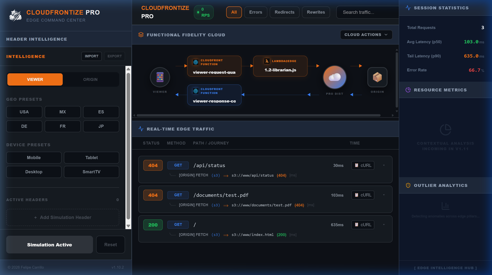

# CloudFrontize Pro: Visual Control Plane

The **CloudFrontize Pro WebUI** (Visual Control Plane) is a high-fidelity diagnostic environment designed for elite Edge engineering. It transforms the "black box" of CloudFront deployments into a transparent, interactive **Functional Highway**.



---

## 🚀 Getting Started

The WebUI is disabled by default to maintain CLI performance. To enable the Visual Control Plane, append the `--webui` flag followed by your desired port:

```bash
cloudfrontize --edge ./my-hooks --webui 3001
```

Once running, navigate to `http://localhost:3001/` to access the live dashboard.

---

## 🛣️ 1. Functional Fidelity Cloud (The Highway)

At the heart of the Pro interface is the **Fidelity Cloud**, a real-time visualization of your distribution's request pipeline.

### Nodes & Stages
The highway visualizes the 4-step CloudFront lifecycle:
- **📱 Viewer**: The point of origin for your simulated traffic.
- **Stations**: Each Lambda@Edge (λ) or CloudFront Function (⚙️) is represented as a "station" on the highway.
    - **Orange Station (λ)**: Represents a Lambda@Edge hook.
    - **Blue Station (⚙️)**: Represents a CloudFront Function block.
- **☁️ Pro Dist**: The simulated CloudFront distribution core.
- **📦 Origin**: Your downstream source (S3, MinIO, or a Multi-Origin setup).

### 🖱️ Node Interactions (Context Menus)
Every functional node is interactive. **Right-click** on any station to access the **Node Actions** menu:

| Action | Description |
| :--- | :--- |
| **View Source** | Opens a real-time code viewer to inspect the active handler's logic. |
| **Copy Path** | Copies the absolute filesystem path to the clipboard for use in your IDE. |
| **Open in Editor** | Attempts to open the source file directly in your default system editor. |
| **Production Export** | A sub-menu offering three levels of code preparation for AWS deployment: |
| &nbsp;&nbsp;&nbsp; *1. Ready* | Bakes all `__VAR__` placeholders into production strings. |
| &nbsp;&nbsp;&nbsp; *2. Minified* | Strips comments/whitespace to reduce payload size. |
| &nbsp;&nbsp;&nbsp; *3. Optimized* | Performs full Uglify/Mangle for maximum performance. |
| **Disable Hook** | Bypasses the hook temporarily without stopping the server. |
| **Isolate** | Disables all *other* hooks, allowing you to test one specific node in isolation. |

---

## 🧠 2. Header Intelligence (The Simulator)

The **Intelligence Panel** in the sidebar is your primary "Simulation Machine". It allows you to inject complex environmental states without changing your code.

### 🌎 Geo Presets
Quickly test location-based routing by clicking one of the six built-in Geo Presets:
- **USA, MX, ES, DE, FR, JP**
- Clicking a preset automatically injects the corresponding `CloudFront-Viewer-Country` and `CloudFront-Viewer-Region` headers into the live simulation.

### 📱 Device Emulation
Simulate how your edge logic responds to different hardware profiles:
- **Mobile, Tablet, Desktop, SmartTV**
- These presets populate headers like `CloudFront-Is-Mobile-Viewer` and `CloudFront-Is-Tablet-Viewer`.

### 🔄 Persistence & Reset
- **Apply Changes**: When you modify headers, the button will **Pulse (Orange)**. Click it to synchronize the simulation with the local engine.
- **Reset**: Instantly clears all simulated headers and reverts to a clean "Vanilla" state.
- **Import/Export**: Port your simulation setup between team members using the standard CloudFrontize Header JSON format.

---

## 🕵️ 3. Real Time Edge Traffic Forensics

The lower section of the dashboard provides a deep-dive into every request that passes through the highway.

### 🌳 The Execution Journey
Click any request row to expand the **Trace View**. This reveals a vertical tree showing exactly which hooks were executed and how they mutated the request.

### 📸 Header Snapshots (Fidelity Analysis)
Unlike a standard debugger, CloudFrontize Pro captures an **immutable snapshot** of the request/response state at *every stage* of the journey.
1.  Expand a request.
2.  In the **Execution Journey** tree, click on any specific stage (e.g., "Origin Request").
3.  The **State Inspector** will display the exact URI and Headers that existed *after* that stage completed.
4.  Compare the **Viewer Provided** headers vs. the **Terminal Response** to see the full transformation lifecycle.

### 🛡️ Fidelity Audit
The **AWS Audit** tool (found under "Cloud Actions") runs an automated linter against your active distribution. It validates:
- Forbidden header mutations (e.g., trying to modify `Host` or `Content-Length`).
- Missing mandatory headers for specific hook types.
- Payload size limit violations (40KB for Viewer Request, 1MB for response generation).

> [!TIP]
> Use the **Simulation Reset** button in the header if you want to clear your traffic history and start a fresh forensic session.

---

## 🚨 4. Auto-Linting & Hot Reload

CloudFrontize Pro features a continuous **Background Watcher** that monitors your source files.

### 🚩 Syntax Alert Banner
If you save a file with a JavaScript syntax error or an AWS Fidelity violation (e.g., using `require` in a CFF block), a **Red Alert Banner** will immediately slide down at the top of the traffic list.

- **Diagnostic Details**: The banner shows the exact file, error type, and the **Line Number**.
- **Source Trace**: An embedded snippet of the offending code is shown, helping you find and fix the bug in seconds.
- **Safe State**: While an error is active, that specific module is bypassed (returning a **502 Bad Gateway**), preventing the entire simulation from crashing.

### 🔄 True Hot Reload
The moment you fix the code in your IDE and hit save, the **Alert Banner automatically closes**, and the updated hook is instantly re-injected into the pipeline—no server restart required.

---
